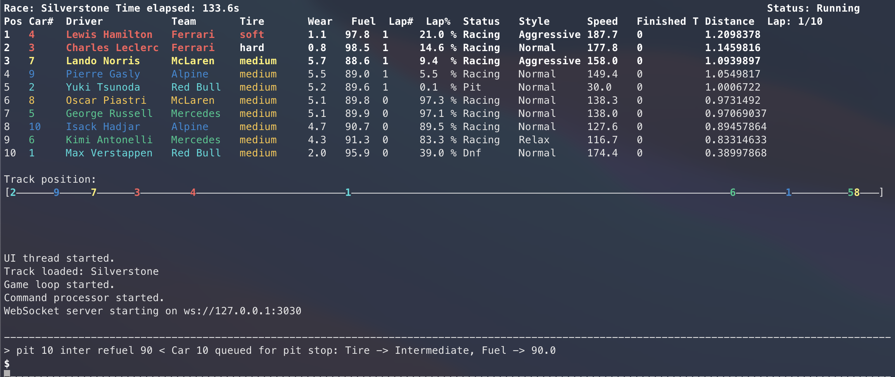
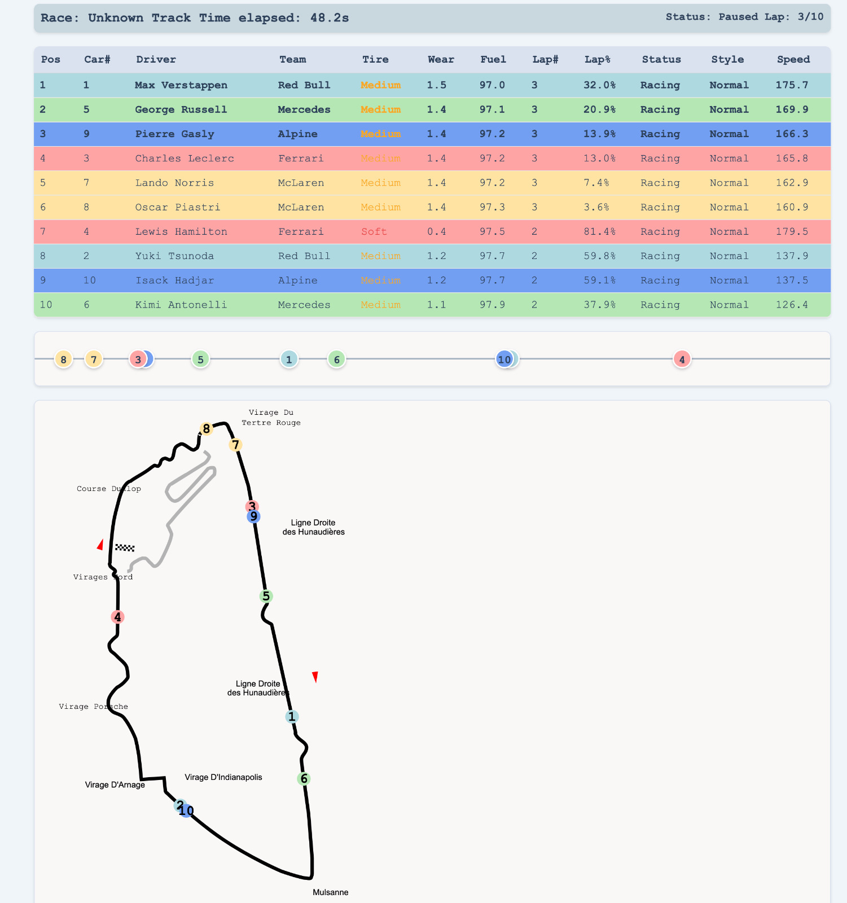

# Tiny Racing

> **Documentation:** Full product, API, and architecture docs for humans and AI agents live in [`docs/`](docs/) and [`AGENTS.md`](AGENTS.md). This README is a short intro; some run instructions below may be outdated.

A team-management Formula 1 race simulation: manage drivers and cars, register for races, and control pit strategy during live events. Backend in Rust; web UI in Vue 3.

## Features

- Real-time race simulation with multiple drivers
- Driver attributes including skill level, stamina, weather tolerance, etc.
- Car and team management
- Tire wear and fuel consumption simulation
- Pit stop strategy
- Text-based UI using ncurses
- WebSocket support for external clients

## Getting Started

### Prerequisites

- Rust toolchain

### Installation

1. Clone the repository
2. Build the simulation app. `cd server && cargo build --release`
3. Install the web client dependencies. `cd tiny-racing-vue && npm install`

### Running (development)

1. Start PostgreSQL and set `DATABASE_URL` (see `server/DATABASE_SETUP.md`).
2. Run the server: `cd server && cargo run` (REST on port 3000, WebSocket on 3030).
3. Run the Vue client: `cd tiny-racing-vue && npm run dev`.

For Docker: see [`DOCKER.md`](DOCKER.md).

### Screenshots

#### Ncurses

#### Web client

#### Credits

- Avatar generation is based on: [https://github.com/dapi-labs/react-nice-avatar/tree/main](https://github.com/dapi-labs/react-nice-avatar/tree/main)
- Flags are coming from: [https://github.com/hampusborgos/country-flags](https://github.com/hampusborgos/country-flags)
- Laurels icon from: https://svgsilh.com/9e9e9e/image/305501.html
