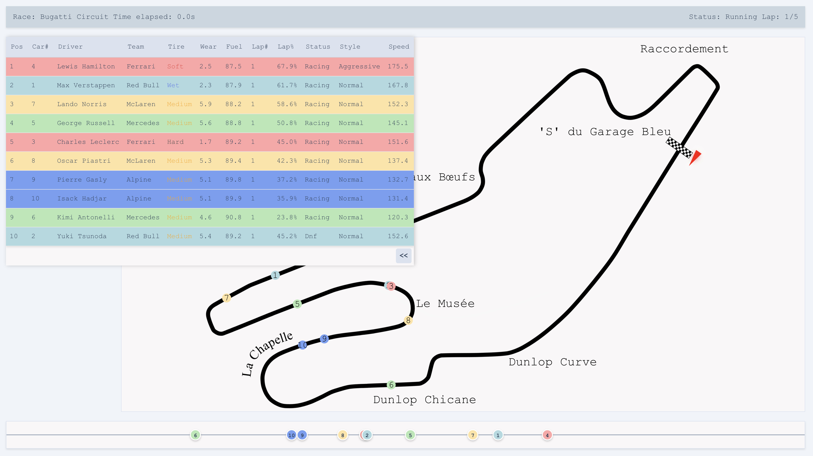

# Tiny Racing

A text-based Formula 1 race simulation game written in Rust.

## Features

- Real-time race simulation with multiple drivers
- Driver attributes including skill level, stamina, weather tolerance, etc.
- Car and team management
- Tire wear and fuel consumption simulation
- Pit stop strategy
- Text-based UI using ncurses
- WebSocket support for external clients

## Getting Started

### Prerequisites

- Rust toolchain

### Installation

1. Clone the repository
2. Build the simulation app. `cd server && cargo build --release`
3. Install the web client dependencies. `cd tiny-racing-vue && npm install`

### Running

1. Run the simulation locally. `cd server && cargo run -- track.json`
2. (optional) Run the simple http server for json and svg assets. `python tiny-racing-vue/server.py`
3. (optional) Run the Vue.js web client. `cd tiny-racing-vue && npm run dev`

### Screenshots

#### Ncurses

#### Web client
